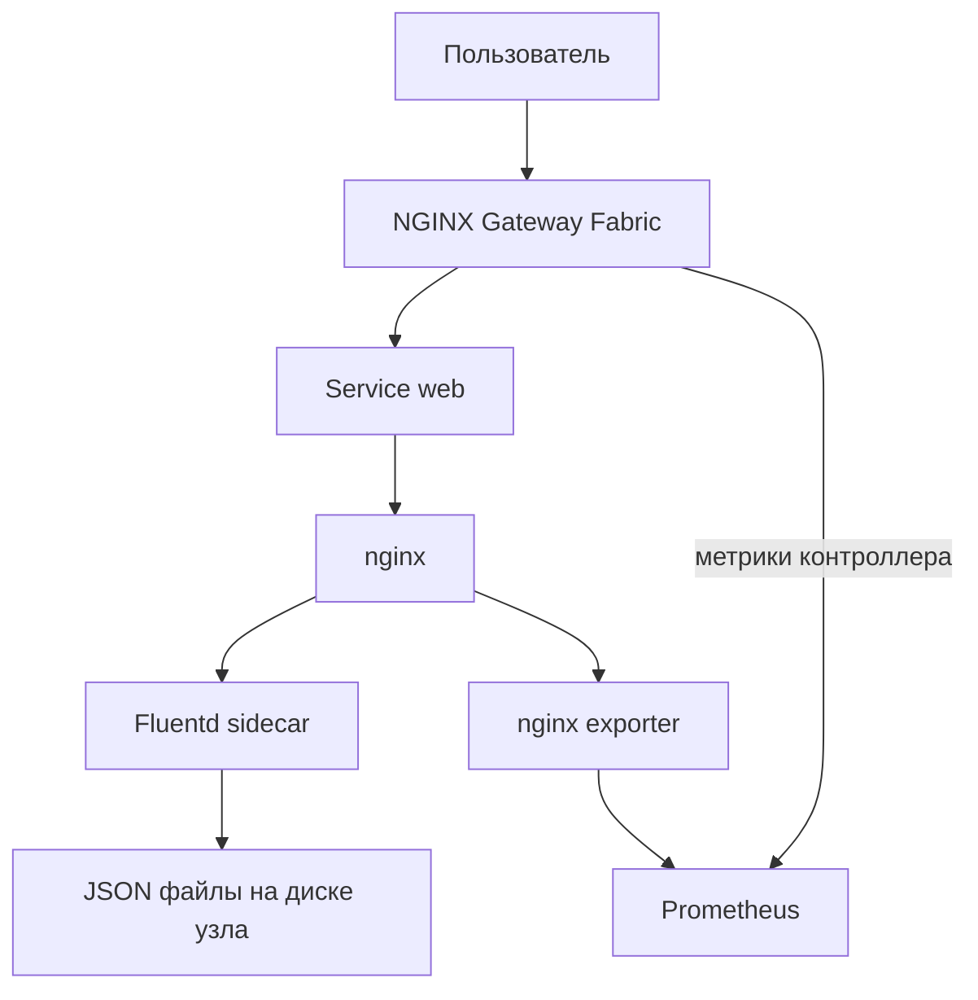

# DevOps стенд для MTC ENGINEER HACK

Сделал одноузловой Kubernetes на **Ubuntu 24.04 amd64** через **kubeadm**.
nginx принимает запросы через **Gateway API**, Prometheus собирает метрики,
Fluentd сохраняет access/error-логи nginx. Основной запуск: `sudo bash deploy.sh`.
Для установки не нужны облачный аккаунт, собственный registry или платные сервисы.

## Архитектура

Обоснование выбора инструментов, хранение данных, повторный запуск и ограничения:
[docs/ARCHITECTURE.md](docs/ARCHITECTURE.md).



`GatewayClass nginx` выбирает контроллер NGF. `Gateway lab` создаёт NGINX data plane;
его Service типа NodePort публикует порт **30080**. `HTTPRoute web` передаёт запросы
в Service `web:80`, затем в nginx на 8080. Заголовок `X-DevOps-Lab: gateway-api`
добавляется HTTPRoute и позволяет отличить этот путь от прямого обращения к приложению.

Приложение и Fluentd находятся в одном StatefulSet Pod: общая директория `/logs`
содержит исходные логи, а Fluentd читает их и пишет отдельные JSON записи в `/collected`.
Это **sidecar-сбор файлов nginx**, а не сбор CRI-логов всех Pod на узле.
Собранные логи и метрики сохраняются в `/var/lib/devops-lab` на диске VM.

## Технологии и версии

| Компонент | Версия | Способ установки |
|---|---|---|
| Ubuntu | 24.04 LTS, amd64 | Отдельная VM пользователя |
| Kubernetes, kubeadm, kubelet, kubectl | 1.35.9; deb 1.35.9-1.1 | Официальный `pkgs.k8s.io`, пакеты удерживаются apt hold |
| containerd | 1.7.x / 2.x из репозитория Ubuntu 24.04 | apt; TOML v2/v3, фактическая версия фиксируется `evidence.sh` |
| Flannel CNI | 0.28.4; CNI plugin 1.9.1-flannel1 | Vendored manifest |
| Gateway API | 1.6.1, standard CRDs | Vendored manifests, server-side apply |
| NGINX Gateway Fabric | 2.7.2, open source | Vendored NodePort manifest и CRDs |
| nginx приложения | 1.28.0-alpine | `nginx:1.28.0-alpine` |
| nginx exporter | 1.4.2 | `nginx/nginx-prometheus-exporter:1.4.2` |
| Prometheus | 3.6.0 | `prom/prometheus:v3.6.0`, собственный StatefulSet |
| Fluentd | 1.18.0 | `fluent/fluentd:v1.18.0-debian-1.0`, встроенные плагины |
| BusyBox | 1.37.0 | Init containers и удаление старых логов |
| Python | 3.12 | Ubuntu; проверки используют ujson, остальные HTTP-инструменты входят в Python |
| ujson | 6.0.0 | Pin в requirements-runtime.txt; отдельный venv для deploy, разработки и CI |
| Git, curl, gnupg, conntrack, socat | Из Ubuntu 24.04 | bootstrap устанавливает автоматически |

### Фактически проверенное окружение

<!-- BEGIN OBSERVED ENVIRONMENT -->
Фактическое окружение: вывод диагностики и проверки 01.10.2026.

| Компонент | Фактическая версия |
|---|---|
| Ubuntu | `Ubuntu 24.04.5 LTS` |
| Ядро Linux | `6.18.40.1-microsoft-standard-WSL2` |
| Среда | `WSL2` |
| Kubernetes | `v1.35.9` |
| containerd | `containerd://2.2.1` |
| kubeadm | `v1.35.9` |
| Клиент kubectl | `v1.35.9` |
| API-сервер Kubernetes | `v1.35.9` |
| Python | `3.12.3` |
| ujson | `6.0.0` |
| Gateway API | `v1.6.1` |
| nginx приложения | `1.28.0-alpine` |
| NGINX Gateway Fabric | `2.7.2` |
| nginx Gateway | `2.7.2` |
| Flannel | `v0.28.4` |
| Prometheus | `v3.6.0` |
| nginx exporter | `1.4.2` |
| Fluentd | `v1.18.0-debian-1.0` |
| BusyBox | `1.37.0` |

Дата сбора: не измерено.
Точные версии пакетов и digest образов: `config/tested-environment.json`.
Закреплённые версии: `config/versions.json`; сбор данных не меняет манифесты и контрольные суммы зависимостей.
<!-- END OBSERVED ENVIRONMENT -->

Полная инструкция запуска, обновления, сборки паспорта и публикации:
[docs/DEPLOYMENT.md](docs/DEPLOYMENT.md). Матрица требований и критериев:
[docs/CRITERIA.md](docs/CRITERIA.md).

Публикация в GitHub: [docs/GITHUB.md](docs/GITHUB.md). Паспорт решения:
[PDF для сдачи](docs/passport.pdf) и [редактируемый Word](docs/passport.docx).
Для подготовки локального Git-репозитория выполнить `bash scripts/prepare-git.sh`
обычным пользователем: скрипт создаст main при первом запуске, подготовит index
и проверит его содержимое; команды commit/push приведены в инструкции.

Официальная таблица NGF указывает для 2.7.2 Gateway API 1.6.1 и Kubernetes 1.32+.
Установка не скачивает manifests с `main` или `latest`: файлы уже включены в `vendor/`,
их целостность проверяется SHA-256. Контейнеры используют конкретные теги версий.
Это не полностью автономная/offline-установка: apt и публичные registries должны быть доступны.

## Что нужно подготовить

- Свежая **отдельная VM** Ubuntu 24.04 amd64, sudo, systemd.
- Минимум 2 vCPU / 4 GB RAM; рекомендуется **4 vCPU / 8 GB RAM / 30 GB диска**.
- Не менее 10 GB свободного места. Стенд рассчитан на небольшой демонстрационный трафик.
- Стабильный IPv4 узла и доступ к нему с компьютера, с которого проверяется приложение.
- Сеть VM не должна пересекаться с `10.244.0.0/16` и `10.96.0.0/12`.
- Интернет: Ubuntu mirrors, `pkgs.k8s.io`, `registry.k8s.io`, `ghcr.io`, Docker Hub.
- Порт TCP 30080 доступен проверяющему; TCP 6443 нужен только для удалённого kubectl.

Не запускать на машине с рабочим Docker/containerd или чужим Kubernetes-кластером.
Bootstrap откажется перезаписывать чужой `containerd/config.toml` или существующий кластер.
Он отключает swap, комментирует swap в `/etc/fstab`, устанавливает службу отключения
swap перед kubelet при загрузке, включает kernel modules/forwarding,
устанавливает системные пакеты и создаёт kubeadm control plane. Резервная копия fstab:
`/var/lib/devops-lab/fstab.before`. Переустановка VM полностью удаляет стенд.

**VirtualBox:** удобнее использовать bridged network и IP VM. При NAT нужен проброс
TCP 30080 в VM; адрес NAT-интерфейса обычно недоступен напрямую с хоста.
SSH-туннель - альтернативный вариант: `ssh -L 30080:127.0.0.1:30080 USER@VM_IP`.

**Firewall:** скрипт не меняет правила UFW. Если UFW активен на этой выделенной VM,
использовать VM в доверенной локальной сети и выполнить `sudo ufw disable` перед установкой,
либо заранее настроить Kubernetes/CNI forwarding и NodePort самостоятельно.
Не отключать firewall на рабочем сервере. Для публичного сервера ограничить доступ
внешним firewall своей сети; готовая конфигурация рассчитана на локальную VM.
Если активен `/dev/zram*` swap, сначала отключить использующий его генератор/сервис
и перезагрузить VM; имя сервиса зависит от установленного пакета.

## Первый запуск

Если после перезапуска WSL kubelet падает с `running with swap on is not supported`,
выполнить `sudo swapoff -a` и `sudo systemctl restart kubelet`. Повторный deploy
теперь исправляет этот случай до проверки API; инструкция и диагностика без API:
[docs/RECOVERY.md](docs/RECOVERY.md).

Скачанный архив содержит папку `devops-lab`. Распаковать и перейти в неё:

```bash
sudo apt-get update
sudo apt-get install -y unzip
unzip devops-lab-fixed.zip
cd devops-lab
sudo bash deploy.sh
```

После публикации репозитория эксперт запускает:

```bash
git clone https://github.com/YOUR_LOGIN/devops-lab.git
cd devops-lab
sudo bash deploy.sh
```

`YOUR_LOGIN` заменить на свой логин. Если у VM несколько сетевых интерфейсов:

```bash
sudo bash deploy.sh --node-ip 192.168.1.50
```

Здесь нужен реальный стабильный IPv4 VM. Скрипт проверит наличие адреса на локальном
интерфейсе и выберет этот интерфейс для Flannel.
Первый запуск может занять 10–20 минут в зависимости от загрузки образов.
Скрипт последовательно ждёт готовности CNI, CoreDNS, контроллера, приложения и мониторинга.
Последняя часть запуска автоматически проверяет Gateway, Prometheus и Fluentd.

Ожидаемый результат - четыре сообщения `[OK]` и `.state/verification.json` со `status: passed`.
При проблеме команда завершится с ненулевым кодом, не будет объявлять установку успешной.

Для пользователя, вызвавшего sudo, kubeconfig копируется в `~/.kube/config`, если там ещё
нет файла. Это административный доступ: его нельзя добавлять в Git или архив сдачи.
Если kubeconfig уже существует, он сохраняется; команды выполнить в root-shell:

```bash
sudo -i
export KUBECONFIG=/etc/kubernetes/admin.conf
cd /ABSOLUTE/PATH/devops-lab
```

### Повторный запуск

```bash
sudo bash deploy.sh
```

Скрипт распознает свой кластер и проверит его версию, не выполнит второй `kubeadm init`.
Остальные ресурсы обновляются через apply. Для web и Prometheus используются отдельные
хеши конфигураций: изменение `/cats` обновляет web, Prometheus при этом не перезапускается.
Повторный запуск не выполняет upgrade Kubernetes и не удаляет логи/метрики.
Менять versions.json без соответствующих изменений manifests/bootstrap нельзя.

### CoreDNS: `plugin/forward: no nameservers found`

В WSL2 systemd-resolved может не иметь uplink DNS: файл
`/run/systemd/resolve/resolv.conf` содержит `No DNS servers known`, хотя
в `/etc/resolv.conf` есть рабочий nameserver. Автоматический выбор kubeadm
может передать Pod пустой DNS-файл, и CoreDNS завершается при запуске.

Обновлённый bootstrap выбирает первый файл с непетлевыми DNS-адресами:
`/run/systemd/resolve/resolv.conf`, затем `/etc/resolv.conf`; существующий
`/var/lib/devops-lab/resolv.conf` используется как последний fallback.
Создаётся отдельный проверенный `/var/lib/devops-lab/resolv.conf`, а
KubeletConfiguration получает явный `resolvConf` с этим путём.
Публичные DNS не подставляются автоматически; используются уже настроенные адреса.
Системные DNS-файлы не изменяются. Список проверяется на наличие IP и loopback,
но доступность UDP/TCP 53 и рекурсивных ответов в твоей сети подтверждается на узле.

Для существующего стенда скачай заново hotfix, распакуй в папке проекта и повтори:

```bash
cd ~/devops-lab
unzip -o /PATH/TO/containerd-hotfix.zip
sudo bash deploy.sh
```

Bootstrap распознаёт созданный кластер. При изменении DNS он сохраняет исходную
конфигурацию kubelet в `/var/lib/devops-lab/kubelet-config.before-dns`, меняет
локальный `/var/lib/kubelet/config.yaml`, перезапускает kubelet и CoreDNS.
Затем deploy-stack ждёт готовности CoreDNS и продолжает приложение.
Повторный запуск с тем же DNS не инициирует новый restart.
Этот локальный override не меняет kubelet-config ConfigMap кластера; для upgrade
или новых узлов нужно отдельно перенести `resolvConf` в управляющую конфигурацию.
Автоматические upgrade и новые узлы в этом стенде не поддерживаются.

### Fluentd: ошибка временного каталога и застрявший StatefulSet

При `could not find a temporary directory` и `/tmp is world-writable` Ruby
отвергает tmp без sticky bit. Init-контейнер задаёт `1777` на том же `fluent-tmp`
emptyDir, который Fluentd монтирует как `/tmp`; non-root и readOnlyRootFilesystem
сохраняются. Неготовый Fluentd делает весь web Pod неготовым, поэтому Service web
не имеет готового backend, а nginx-exporter сообщает connection refused.

Если старый неготовый Pod блокирует StatefulSet RollingUpdate, одного apply
недостаточно. После применения новых manifests скрипт сначала обновляет config hash,
ждёт observedGeneration контроллера и проверяет revision Pod. Helper пересоздаёт
только неготовый Pod старой revision своего single-replica StatefulSet, с обычным
grace period и UID/resourceVersion preconditions. Pods новой revision не удаляются,
чтобы сохранить новую ошибку для диагностики. HostPath логи и TSDB сохраняются;
исходные `/logs` и временные файлы в emptyDir пересоздаются вместе с Pod.

Обновить файлы из актуального hotfix внутри существующего проекта и выполнить:

```bash
sudo bash deploy.sh
kubectl -n devops-lab get pods
```

Ожидается `web-0` с READY `2/2` и успешная автоматическая проверка.
При ошибке собрать `bash scripts/diagnose.sh`: вывод теперь включает template/revision
StatefulSet, описание web Pod, EndpointSlices и предыдущие логи Fluentd.

### Продолжение после ошибки containerd

В старой поставке сообщение `Ubuntu containerd 1.x configuration is required.` означало,
что bootstrap не распознал формат сгенерированного TOML. В обновлениях Ubuntu 24.04
есть containerd 2.x: вместо `sandbox_image` он использует `pinned_images.sandbox`.
Исправленная версия поддерживает оба формата и оба вида кавычек, проверяет TOML через
Python `tomllib`, затем через `containerd config dump` до замены рабочего файла.

Если уже получил **именно это сообщение** при запуске старого архива, скачай
`containerd-hotfix.zip` и распакуй **внутри существующей папки проекта**:

```bash
cd /ABSOLUTE/PATH/devops-lab
unzip -o ~/Downloads/containerd-hotfix.zip
sudo bash deploy.sh --resume-bootstrap
```

Путь к архиву заменить на свой. При нескольких интерфейсах можно добавить
`--node-ip 192.168.1.50`. Hotfix содержит актуальные файлы проекта с путями относительно его корня;
не включает `.state/` и настройки Git. Подробности в `HOTFIX.md`. Полный обновлённый архив - `devops-lab-fixed.zip`.
Для новой VM флаг не нужен: обычная команда `sudo bash deploy.sh`.

`--resume-bootstrap` признаёт только следы старого bootstrap до `kubeadm init`:
`containerd.new`, резервную копию fstab, ключ Kubernetes и файлы настройки host.
При работающем containerd он проверяет все namespaces на контейнеры/tasks;
при остановленном runtime со своей базой данных требует сначала запустить сервис для проверки.
Чужой кластер, Docker `containerd.io`, посторонние контейнеры и частичная инициализация
kubeadm не восстанавливаются автоматически. Исходный containerd config сохраняется
в `/var/lib/devops-lab/containerd.config.before`. Сбрасывать kubeadm из-за этой ошибки не нужно.

Пустой служебный `/etc/kubernetes/manifests/.kubelet-keep` не означает наличие
control plane. Исправленная проверка игнорирует файлы, начинающиеся с точки,
как kubelet. Видимые файлы, включая backup и symlinks, по-прежнему блокируют
автоматическое продолжение независимо от расширения.

При повторных сбоях сначала собрать диагностику:

```bash
containerd --version
sudo systemctl status containerd --no-pager
sudo journalctl -u containerd -n 100 --no-pager
```

## Проверка Gateway API

```bash
kubectl get nodes -o wide
kubectl -n devops-lab get pods,svc,gateway,httproute
kubectl get gatewayclass nginx
kubectl -n devops-lab describe gateway lab
kubectl -n devops-lab describe httproute web
```

`GatewayClass: Accepted=True`; `Gateway: Accepted=True, Programmed=True`;
`HTTPRoute: Accepted=True, ResolvedRefs=True` в status.parents.
Автоматическая проверка также сверяет observedGeneration: старый успешный статус
после изменения ресурса не считается подтверждением новой конфигурации.

```bash
NODE_IP=$(kubectl get nodes -o jsonpath='{.items[0].status.addresses[?(@.type=="InternalIP")].address}')
curl -i "http://$NODE_IP:30080/"
curl "http://$NODE_IP:30080/info"
```

Первый запрос должен вернуть HTTP 200, `X-DevOps-Lab: gateway-api` и `Hello World!`.
`/info` возвращает JSON с `service: devops-lab`. Несуществующий путь возвращает HTTP 404
и создаёт error-лог nginx. Порт 30080 относится к Gateway data plane, не к Service приложения.

Дополнительные маршруты работают именно в Gateway API:

```bash
curl -i "http://$NODE_IP:30080/api/info"
curl -i "http://$NODE_IP:30080/legacy"
curl -L "http://$NODE_IP:30080/legacy"
```

`HTTPRoute api-info` переписывает `/api/info` в `/info` через URLRewrite и добавляет
`X-DevOps-Route: api-rewrite`; nginx самостоятельно `/api/info` не обслуживает.
`HTTPRoute legacy-redirect` возвращает HTTP 302 на `/api/info`. Явный port 30080
сохраняет доступ через NodePort, поскольку listener Gateway использует внутренний port 80.
Smoke-тест проверяет все три HTTPRoute, JSON и Location без автоматического следования
редиректу; случайный HTTP 200 после перехода не считается проверкой HTTP 302.

### Страница с котиком

Открыть `http://NODE_IP:30080/cats`: присланное изображение и подпись
«Котик был доставлен через Kubernetes». Страница и `/cats/cat.png` обслуживаются
nginx через существующий HTTPRoute web и получают заголовок X-DevOps-Lab.
Исходники: web/cats.html и web/cat.png; deploy создаёт ConfigMap web-cats
через server-side apply, монтирует его read-only и учитывает файлы в config hash.
verify.py проверяет страницу, Gateway headers и точное совпадение байтов PNG.

## Проверка Prometheus

В первом терминале:

```bash
kubectl -n devops-lab port-forward svc/prometheus 9090:9090 --address=127.0.0.1
```

Во втором терминале:

```bash
curl -fsS http://127.0.0.1:9090/api/v1/targets
curl -fsSG http://127.0.0.1:9090/api/v1/query --data-urlencode 'query=up{job="nginx"}'
curl -fsSG http://127.0.0.1:9090/api/v1/query --data-urlencode 'query=nginx_up'
curl -fsSG http://127.0.0.1:9090/api/v1/query --data-urlencode 'query=nginx_http_requests_total'
curl -fsSG http://127.0.0.1:9090/api/v1/query --data-urlencode 'query=up{job="gateway-controller"}'
```

Открыть `http://127.0.0.1:9090` в браузере на VM. Для браузера своего компьютера использовать
`ssh -L 9090:127.0.0.1:9090 USER@VM_IP`, оставив port-forward запущенным на VM.
У трёх targets `health=up`; две метрики `up` и `nginx_up` равны 1;
`nginx_http_requests_total` растёт после HTTP-запросов. Интервал сбора - 10 секунд.
Также доступны `nginx_connections_active`, `nginx_connections_reading/writing/waiting`,
Go/process метрики Gateway Controller и метрики самого Prometheus.
Порт stub_status 8081 используется только внутри кластера и не маршрутизируется Gateway.

Alert `NginxUnavailable` срабатывает через минуту при недоступности nginx/экспортера.
Проверяется также исчезнувшая серия через `absent()`; второй alert отслеживает
Gateway Controller. Recording rules: `lab:nginx_requests_per_second:rate5m`
и `lab:gateway_controller_memory_bytes`. Для request rate нужны минимум два scrape;
нулевой RPS в отсутствие трафика нормален. Правила имеют promtool тесты регрессий.
Он виден в Prometheus `/alerts`; отправка уведомлений не настроена (нет Alertmanager).
Prometheus доступен через ClusterIP и локальный port-forward, без публичного NodePort.

## Проверка Fluentd

```bash
curl "http://$NODE_IP:30080/?check=my-request-001"
curl "http://$NODE_IP:30080/does-not-exist-my-request-001"
kubectl -n devops-lab logs web-0 -c fluentd --tail=30
kubectl -n devops-lab exec web-0 -c fluentd -- sh -c 'grep -h "my-request-001" /collected/events*.log'
```

Через несколько секунд в JSON файлах появятся записи с `source=nginx.access`, URI,
HTTP status, request_time и запись с `source=nginx.error`, содержащая отсутствующий путь.
`kubectl logs -c fluentd` показывает служебный лог агента; подтверждение сбора приложения
находится именно в `/collected/events*.log`.
На VM эти файлы лежат в `/var/lib/devops-lab/logs/`; position files и file buffer
сохраняются там же. Встроенные плагины Fluentd: tail, json/none parse, record_transformer,
file output. Elasticsearch/Loki и установка дополнительных Ruby-плагинов не требуются.

## Ротация исходных логов

`emptyDir` с исходными логами сохраняет лимит **128 MiB**. Скрипт
`scripts/nginx-run.sh` работает внутри контейнера nginx от UID 101: раз в секунду
проверяет access.log и error.log, при 8 MiB или через 10 секунд для непустого файла
сохраняет старый inode через hardlink, атомарно заменяет активный файл и отправляет
nginx сигнал USR1. nginx переоткрывает логи, не обрезая файл во время записи.
Сохраняются четыре последних архива на лог. Имена содержат время, PID и счётчик;
после создания архивы больше не переименовываются, чтобы Fluentd не терял путь к inode.

При размерах ровно у порога два активных файла и восемь архивов занимают около 80 MiB.
Остаток нужен для прироста между проверками; это расчёт бюджета, а не жёсткая квота
каждого файла. Fluentd читает активные файлы и архивы, следит за inode и сохраняет
позиции на hostPath; раз в час уплотняет pos_file, убирая старые позиции. Активный путь существует во время всей ротации; это обходит
гонку с исчезновением файла в Fluentd 1.18. `rotate_wait 5` позволяет дочитать старый inode,
а архивы остаются в списке чтения.
Удаляется самый старый архив, поэтому при долгом отставании агента часть событий
может выйти за окно хранения. На диске узла собранные события удаляет отдельный CronJob.

Проверка через настоящий Gateway создаёт 24576 HTTP 404 запросов с длинным URI,
чтобы получить несколько ротаций обоих логов. Порции по 2048 запросов разделены паузой
1.1 секунды для работы ротатора, в том числе на быстрой VM. Выполнять на своём учебном стенде:

```bash
export PATH="/var/lib/devops-lab/venv/bin:$PATH"
python3 scripts/check-log-rotation.py --url http://NODE_IP:30080
cat .state/log-rotation.json
kubectl -n devops-lab exec web-0 -c nginx -- sh -c 'ls -lh /logs; du -sh /logs'
```

Подставить свой адрес вместо NODE_IP. Проверка требует четыре архива для обоих логов,
объём меньше 128 MiB и ровно одну access/error запись каждого request ID в собранных
файлах. Ошибка или прерывание не оставляет старый passed. Этот тест дополняет verify.py;
обычный smoke не подтверждает нагрузочную ротацию.

## Общая проверка и подтверждение на Ubuntu

```bash
export PATH="/var/lib/devops-lab/venv/bin:$PATH"
python3 scripts/verify.py
bash scripts/evidence.sh
sudo bash deploy.sh
python3 scripts/verify.py
```

`verify.py` проверяет состояние Gateway, ответ/заголовок/JSON/404,
три живых источника метрик Prometheus и access/error-записи с уникальной меткой
в собранных Fluentd файлах. Дополнительно измеряет счётчик до и после пяти запросов,
проверяет четыре правила Prometheus и конечные значения вычисленных метрик.
Результаты находятся в полях `traffic`, `prometheus_rules`, `metrics` и `logs`
файла `.state/verification.json`. При ошибке отчёт получает `status: failed`.
`evidence.sh` сохраняет версию ОС, ядра, пакетов, образы/digests и результаты проверки
в `.state/`. Эти файлы по умолчанию исключены из Git и не содержат kubeconfig.

**Статус проверки:** пользователь предоставил успешную полную автоматическую проверку базовой
цепочки на Ubuntu 24.04.5 WSL2, Kubernetes 1.35.9, containerd 2.2.1: HTTP, Gateway,
живые метрики и обе категории собранных логов. 03.10.2026 подтверждены работа стенда
и доступ из Windows. Актуальные JSON-отчёты всех маршрутов, /cats, новых проверок метрик и повторного
деплоя собрать командой `sudo bash scripts/check-repeat.sh`.
В среде подготовки выполняются локальные Python/YAML/CRD/OpenAPI/shell/component
проверки. Отдельная свежая VM и GitHub Actions ещё требуют самостоятельного запуска.
Сведения об окружении: `config/tested-environment.json`, ревью: `docs/REVIEW.md`.

## Дополнительные возможности

- Три HTTPRoute: основной маршрут, path URLRewrite и HTTP 302 redirect; ResponseHeaderModifier.
- Сбор метрик nginx, Gateway Controller и Prometheus; два alert и два recording rules.
- Измерение счётчика до и после пяти запросов; проверка вычисления правил Prometheus.
- `startupProbe` Prometheus даёт до трёх минут на восстановление базы метрик при запуске.
- Автоматический сбор версий ОС/runtime/компонентов, пакетов и digest образов; обновление README/паспорта.
- Два последовательных деплоя с раздельными отчётами проверки; старые успешные отчёты не маскируют сбой.
- Access-логи в JSON, однозначная корреляция запроса с собранным логом.
- Ротация access/error через hardlink, атомарную замену и USR1 внутри nginx, без дополнительного образа и root.
- Проверка ротации через Gateway: все request ID должны появиться ровно один раз в Fluentd.
- Сохранение Fluentd buffer/position и Prometheus TSDB на диске VM.
- CronJob удаляет завершённые файлы собранных логов старше 7 полных суток; текущие
  position/buffer файлы не затрагивает. Prometheus retention: 7 дней / 1 GB для блоков TSDB.
- Основные контейнеры приложения/мониторинга работают без root, с read-only rootfs,
  drop ALL, seccomp и без ServiceAccount token. Небольшие init containers запускаются
  root только для установки владельца выделенных hostPath-каталогов.
- GitHub CI: проверка синтаксиса, схем, тестов и конфигураций, временный kind-кластер с Flannel,
  развёртывание, автоматическая проверка и повторное развёртывание. CI не использует пользовательские секреты.

## GitHub и сдача

Подробные команды: [docs/GITHUB.md](docs/GITHUB.md).
Паспорт: [docs/passport.pdf](docs/passport.pdf), не более четырёх страниц.
В текущей версии три страницы: схема и состав решения, функциональность с проверками,
ревью и план развития. PDF и Word собираются из общего текста; схема создаётся кодом.
После сбора фактических версий и пересборки паспорта через `bash scripts/finalize-docs.sh`
публиковать репозиторий и собрать архив, заменив логин и фамилию:

```bash
.venv/bin/python scripts/make_submission.py \
  --repo https://github.com/YOUR_LOGIN/devops-lab/tree/main \
  --surname YOUR_SURNAME --check-public
```

В `submission/YOUR_SURNAME.zip` будут **ровно** `Ссылка.txt` с одной ссылкой и `Паспорт.pdf`.
Архив исходников `devops-lab-fixed.zip` служит для получения проекта, а не заменяет этот архив сдачи.
Репозиторий должен оставаться публичным; рабочее решение должно находиться в main.
По тексту задания приём до **4 октября 23:59**, изменения main после срока запрещены.
Часовой пояс в присланном документе не указан: проверить его у организаторов.

## Ограничения и восстановление

- Одна VM, один control plane, один web Pod; высокая доступность и масштабирование не заявлены.
- hostPath привязан к узлу; при потере VM теряются данные. Для нескольких узлов нужны PVC,
  сетевой storage и отдельный централизованный сбор логов.
- Flannel не обеспечивает NetworkPolicy; сетевую изоляцию namespaces решение не заявляет.
- Доступ HTTP, без TLS/авторизации. Для production нужны TLS, RBAC пользователей, firewall,
  сетевые политики, резервные копии и актуальные security updates.
- Исходные `/logs` ротируются в emptyDir 128 MiB: порог 8 MiB, четыре архива на каждый лог.
  Проверка размера выполняется раз в секунду; размер файла может превысить порог между
  проверками. При очень резком потоке или отставании Fluentd возможны eviction или потеря
  событий из удалённых старых архивов. Бесконечная нагрузка без потерь не заявляется.
- Retention Prometheus ограничивает блоки; WAL и активный head требуют дополнительного диска.
- Python не является веб-приложением: собственная разработка не даёт дополнительных баллов;
  он используется для автоматизации и проверок, которые проще поддерживать с опытом Python.
- kind в CI использует Kubernetes 1.35.8; основной стенд - kubeadm 1.35.9. CI проверяет
  manifests и поведение стека, но не установку системных пакетов/bootstrap на VM.

При ошибке:

```bash
sudo env KUBECONFIG=/etc/kubernetes/admin.conf bash scripts/diagnose.sh
sudo journalctl -u kubelet -u containerd -n 100 --no-pager
```

Диагностика проверяет доступ к API, затем CoreDNS (Pod, describe/Events и logs).
При запуске через sudo скрипт сам выбирает `/etc/kubernetes/admin.conf`, если
KUBECONFIG не задан. Явно заданный KUBECONFIG сохраняется. Если API недоступен,
скрипт останавливается после первой проверки вместо повторения localhost:8080 ошибок.
Логи приложения собираются только при наличии его namespace.

ImagePullBackOff обычно означает недоступность registry; проверить сеть и image name.
Pending - проверить requests, объём памяти и taints. NotReady - проверить Flannel и containerd.
Если kubeadm init прервался, скрипт не сбрасывает кластер автоматически. Предпочтительный
путь для выделенной VM - восстановить её свежий snapshot и повторить установку.
Для ручного восстановления только собственного пустого стенда: `sudo kubeadm reset -f`,
удалить оставшуюся конфигурацию CNI/маркер этого проекта и выполнить повторный bootstrap;
reset сам по себе не очищает CNI и сетевые правила. Не использовать reset на рабочем кластере.

## Файлы

| Путь | Назначение |
|---|---|
| `deploy.sh` | Одна команда для VM: подготовка системы + компоненты + проверка |
| `scripts/bootstrap.sh` | Пакеты Ubuntu, containerd, kubeadm, host preflight |
| `scripts/nginx-run.sh` | Запуск nginx, завершение по QUIT, ротация 8 MiB / четыре архива |
| `scripts/check-log-rotation.py` | Нагрузочная проверка Gateway/ротации/полноты логов Fluentd |
| `scripts/setup-python.sh` | Идемпотентная установка ujson 6.0.0 в отдельный venv стенда |
| `scripts/configure-containerd.py` | TOML v2/v3, systemd cgroups и pause image; tomllib и ujson |
| `scripts/configure-dns.py` | Выбор upstream DNS, отдельный resolv.conf и восстановление DNS-конфигурации kubelet |
| `scripts/configure-swap.sh`, `scripts/check-cluster.py` | Отключение swap перед kubelet; ограниченное ожидание и сверка версии существующего API |
| `scripts/deploy-stack.sh` | CNI, CRDs, Gateway Controller, приложение, мониторинг и логи |
| `k8s/` | Собственные Kubernetes ресурсы |
| `vendor/` | Зависимости, SHA-256, источники и лицензии |
| `scripts/verify.py` | Gateway, HTTP/rewrite/redirect, метрики и собранные логи; Python и ujson |
| `scripts/check-repeat.sh` | Два развёртывания и проверки и отдельные отчёты идемпотентности |
| `scripts/prepare-git.sh`, `scripts/check-publication.py` | Подготовка локального Git index и проверка файлов перед публикацией |
| `scripts/collect-versions.py`, `scripts/finalize-docs.sh` | Фактические версии/digests, README и паспорт |
| `docs/DEPLOYMENT.md`, `docs/CRITERIA.md` | Пошаговый запуск/сдача и соответствие всем критериям |
| `docs/ARCHITECTURE.md` | Архитектура, выбор инструментов, хранение данных и обоснование ограничений |
| `scripts/diagnose.sh`, `scripts/evidence.sh` | Диагностика и отчёт окружения |
| `scripts/diagnose-host.sh`, `docs/RECOVERY.md` | Диагностика без работающего API и восстановление WSL после включения swap |
| `scripts/validate.py`, `tests/` | Статические и unit-проверки |
| `.github/workflows/ci.yml` | CI на GitHub Actions |
| `scripts/make_submission.py` | Архив формата, указанного организаторами |
| `scripts/build_passport.py`, `scripts/build_passport_docx.py`, `scripts/passport_content.py` | Пересборка PDF и Word из одного текста |
| `docs/OPERATIONS.md` | Краткие объяснения и сценарии для защиты |

Для разработки/пересборки паспорта нужны отдельные зависимости, при развёртывании они не нужны:

```bash
sudo apt-get install -y python3-venv fonts-dejavu-core shellcheck
python3 -m venv .venv
.venv/bin/pip install -r requirements-dev.txt
.venv/bin/python scripts/validate.py
.venv/bin/python -m unittest discover -s tests -v
shellcheck deploy.sh scripts/*.sh
.venv/bin/python scripts/build_passport.py
```

## Первичные источники

- [Установка kubeadm](https://kubernetes.io/docs/setup/production-environment/tools/kubeadm/install-kubeadm/)
- [Container runtimes и systemd cgroups](https://kubernetes.io/docs/setup/production-environment/container-runtimes/)
- [NGF версии и совместимость](https://github.com/nginx/nginx-gateway-fabric/tree/v2.7.2)
- [Установка NGF manifests](https://docs.nginx.com/nginx-gateway-fabric/install/manifests/open-source/)
- [Gateway API](https://gateway-api.sigs.k8s.io/)
- [Prometheus configuration](https://prometheus.io/docs/prometheus/latest/configuration/configuration/)
- [Fluentd tail](https://docs.fluentd.org/input/tail) и [file output](https://docs.fluentd.org/output/file)
- [Flannel](https://github.com/flannel-io/flannel/tree/v0.28.4)
