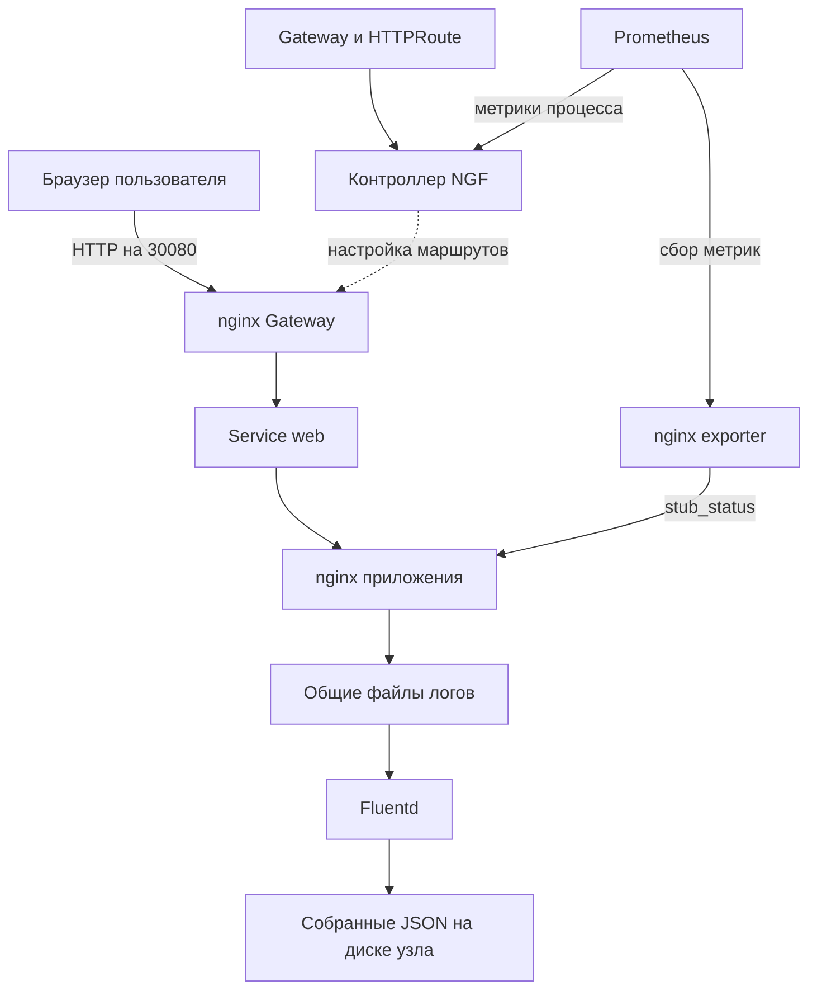

# Архитектура и выбор инструментов

Сделал одноузловой стенд на Ubuntu 24.04: kubeadm создаёт Kubernetes, nginx обслуживает
приложение, Gateway API организует доступ снаружи. Prometheus получает метрики,
Fluentd сохраняет логи. Python использовал для проверок, настройки containerd и DNS,
сбора версий и подготовки документов. Так проще поддерживать решение с моим опытом Python.

## Как проходит запрос

Контроллер NGF читает ресурсы Gateway API и настраивает отдельный nginx для приёма
трафика. Сам контроллер HTTP-запросы приложения не обслуживает. Service этого nginx
публикуется на NodePort 30080. Дальше запрос проходит в Service `web:80` и контейнер
nginx на порту 8080. Метрики приложения доступны через отдельный внутренний порт 8081.

| Ресурс | Для чего нужен | Что подтверждает проверка |
|---|---|---|
| `GatewayClass nginx` | Выбирает контроллер NGF | `Accepted=True` для текущего поколения |
| `Gateway lab` | Создаёт HTTP listener и nginx для приёма трафика | `Accepted=True`, `Programmed=True` |
| `HTTPRoute web` | Передаёт пути приложения в Service web | HTTP 200, JSON, 404, `/cats`, заголовок `X-DevOps-Lab` |
| `HTTPRoute api-info` | Переписывает `/api/info` в `/info` | Ответ JSON и `X-DevOps-Route: api-rewrite` |
| `HTTPRoute legacy-redirect` | Перенаправляет `/legacy` на `/api/info` | HTTP 302, правильные адрес, путь и порт |

Проверка статусов учитывает `observedGeneration`, поэтому успешный ответ контроллера
на старую конфигурацию не подтверждает новое изменение. `verify.py` также отправляет
реальные HTTP-запросы через внешний порт Gateway.

## Почему выбрал kubeadm

kubeadm - основной способ установки и приоритет задания. Он позволяет настроить
Kubernetes на обычной Ubuntu и показать работу containerd, kubelet, CNI и control plane.
Flannel выбран для простой сети одного узла. Для локальной демонстрации подошёл WSL2.
Для воспроизведения на другой машине удобнее отдельная VM со стабильным IP и systemd.

Белый IP для локального стенда не нужен. Из Windows можно открыть адрес WSL с портом
30080 или использовать локальный `kubectl port-forward`. Публичный доступ, HTTPS и
домен требуют отдельной сетевой настройки.

## Почему приложение и Fluentd находятся в одном Pod

Для одного nginx проще использовать Fluentd как второй контейнер того же Pod.
Он читает access- и error-файлы из общей директории, добавляет поле `source` и пишет
собранные записи в отдельную директорию. Дополнительное хранилище вроде Elasticsearch
для выполнения задания не требуется.

Использовал StatefulSet с одной репликой: у Pod стабильное имя, один Fluentd работает
с одним набором файлов позиции чтения и буфера. Это не делает стенд отказоустойчивым.
Для нескольких копий приложения потребуется изменить схему хранения и сбора логов.

## Где находятся данные

| Данные | Хранение | Что происходит при пересоздании Pod |
|---|---|---|
| Исходные логи nginx | `emptyDir`, до 128 MiB | Удаляются вместе с Pod |
| JSON-записи Fluentd, позиция чтения, буфер | `/var/lib/devops-lab/logs`, `hostPath` | Сохраняются на том же узле |
| База метрик Prometheus | `/var/lib/devops-lab/prometheus`, `hostPath` | Сохраняется на том же узле |
| HTML и изображение `/cats` | Файлы проекта и ConfigMap | Восстанавливаются при развёртывании |

CronJob ежедневно удаляет завершённые файлы логов по условию `mtime +7`, не трогая
буфер и позицию чтения. Prometheus хранит блоки до 7 дней или до 1 GB; активная часть
базы и WAL требуют дополнительного места. `hostPath` подходит для одного узла,
для нескольких узлов нужен PVC и выбранный способ резервного копирования.

Исходные логи ротирует scripts/nginx-run.sh в том же nginx-контейнере: порог 8 MiB или
10 секунд для непустого файла,
четыре архива на каждый лог, проверка раз в секунду. После атомарной замены активного файла сигнал USR1
переоткрывает файлы. Fluentd читает активные файлы и архивы с follow_inodes и rotate_wait 5.
Активный путь не исчезает при смене файлов: это обходит гонку Fluentd 1.18. Номинальный бюджет - около 80 MiB из 128 MiB.
Порог может быть превышен между проверками; при отставании агента старые события
могут выйти из окна хранения. Нагрузку проверяет scripts/check-log-rotation.py.
Раз в час Fluentd уплотняет pos_file и убирает позиции удалённых архивов, чтобы
длительная ротация не увеличивала этот файл без ограничения.

Python-скрипты используют ujson 6.0.0. Bootstrap создаёт отдельный venv в
/var/lib/devops-lab/venv; зависимости системного Python не меняются. Версия закреплена
в requirements-runtime.txt и подключается из requirements-dev.txt для разработки/CI.

## Что показывает мониторинг

Prometheus опрашивает nginx exporter, контроллер Gateway и себя каждые 10 секунд.
Exporter получает данные из `stub_status`: доступность nginx, число запросов и соединения.
Метрики контроллера показывают состояние его процесса, например использование памяти.

`verify.py` считывает счётчик запросов, отправляет пять запросов через Gateway и ждёт
его роста минимум на пять. В JSON сохраняются значения до и после, разница и число
запросов. Счётчик nginx включает также служебные запросы, поэтому разница может быть
больше пяти. Скрипт проверяет все три источника, состояние двух предупреждений и двух
правил вычисления метрик. Старое ненулевое значение само по себе проверку не проходит.

Предупреждения видны в Prometheus. Отправка уведомлений не настроена, для неё нужен
Alertmanager. `stub_status` не даёт метрики HTTP-кодов и распределение задержки;
код ответа и время запроса сейчас доступны в JSON-логах.

## Как проверяется сбор логов

Python отправляет успешный запрос и запрос с ожидаемым HTTP 404, используя уникальную
метку. Затем ищет эту метку в итоговых JSON-записях Fluentd: в access-записи с HTTP 200
и в error-записи с отсутствующим путём. Так подтверждается сбор новых событий.
Служебный вывод `kubectl logs` сам по себе этого не доказывает.

## Как устроен повторный запуск

1. Bootstrap распознаёт свой кластер, проверяет его версию и доступность API.
2. В WSL отключает снова появившийся swap до проверки API; при изменении DNS обновляет
   выделенный DNS-файл kubelet. Системный DNS не заменяется.
3. Манифесты применяются повторно через `kubectl apply`.
4. Для web и Prometheus рассчитываются отдельные хеши конфигурации. Изменение `/cats`
   обновляет web, конфигурацию Prometheus оно не затрагивает.
5. После обновления скрипт ждёт готовности и запускает полную проверку.

Если обновление StatefulSet заблокировал старый неготовый Pod, helper проверяет
владельца, ревизию, UID и resourceVersion и пересоздаёт только этот Pod штатным способом.
Сбой Pod с текущей ревизией остаётся для диагностики. Автоматического сброса кластера нет.

Для Prometheus добавлена `startupProbe`: до трёх минут на запуск и восстановление
базы. После успешного запуска работают проверки готовности и состояния процесса.

## Что проверяет GitHub Actions

CI проверяет исходники, схемы и конфиги, создаёт временный kind-кластер, дважды
разворачивает стек и сохраняет два отчёта. Комментарии и названия этапов написаны
по-русски. kind нужен для автоматических проверок на машине GitHub; основной способ
установки остаётся kubeadm. CI не подтверждает установку пакетов на свежей Ubuntu VM.

## Надёжность и безопасность

Основные контейнеры работают без root, с ограничениями CPU/RAM, seccomp, закрытыми
capabilities и файловой системой только для чтения. Приложению и мониторингу не нужен
токен ServiceAccount. Init-контейнеры имеют только необходимые права для своих каталогов.

Конфигурации зависимостей сохранены в `vendor/` с проверкой SHA-256. Их комментарии,
описания CRD и лицензии оставлены в исходном виде для сверки с источником.
Технические имена API, метрик, ключи JSON/YAML и сообщения сторонних программ не переводятся.

`.gitignore` исключает kubeconfig, ключи, окружения и сырые отчёты. Перед коммитом
проверяется содержимое индекса Git, затем его нужно просмотреть вручную.
Проверка индекса не заменяет проверку истории ранее опубликованного репозитория.

## Порядок дальнейших улучшений

Приоритеты и команды подтверждения собраны в [CRITERIA.md](CRITERIA.md).
Сначала стоит получить актуальные отчёты двух развёртываний, точные версии,
зелёный CI и запуск из публичного репозитория на свежей VM. Затем можно добавлять
HTTPS, резервные копии и уведомления; ротация исходных логов уже реализована.
